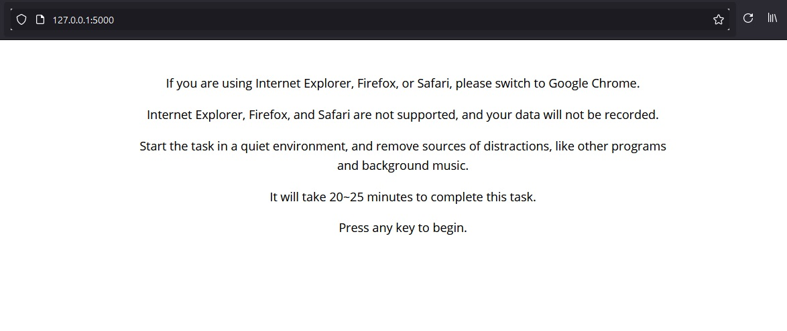
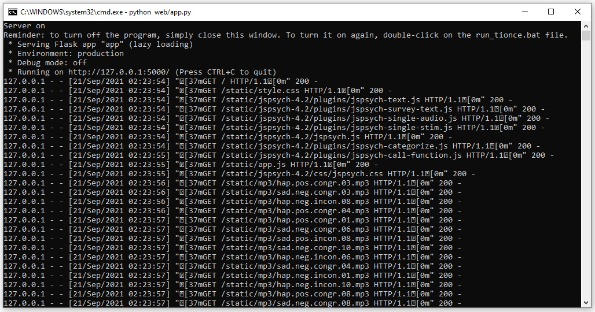

# tionce_voices
Tionce_voices is a browser based testing system designed to assess a participant's ability to process conflicting stimuli. It uses a jsPsych frontend to create the test, and a Flask backend to collect data for processing. This application was used in a study to help understand if a group of individuals in a Midwestern prison were able to process such stimuli correctly. Due to the personal nature of some of the parts of the project, these are currently only the main files that I worked on. The rest of the code may be uploaded at a later date, depending on what the researcher wishes.

# Overview
 
The session begins by presenting a welcome screen and prompting the participant for their assigned number, after which a sequence of instructions for the current test block is displayed. A short practice is given, and then the real test block begins. There are multiple different test blocks, and the order they're delivered in is randomized for each session. Each block checks a participant's ability to respond to conflicting stimuli using different combinations of opposite audio, visual, and textual cues. When the participant completes all of the test blocks, their results are recorded and the test is finished.

# Backend

A simple self-hosted Flask server was used as the backend for this project. To make the application easy for anyone to use, the server was turned on by clicking a .bat file on the desktop, and turned off by closing the cmd window.

# Data Recording and Processing
As soon as the test completes, its results are posted to the endpoint specified in <code>app.py</code>. The columns and rows of the results are then modified into a format readable by an R script written by the researcher, and their contents are appended to a longterm test CSV file that serves as the database for the project. An example of a single-run output file is provided. 
